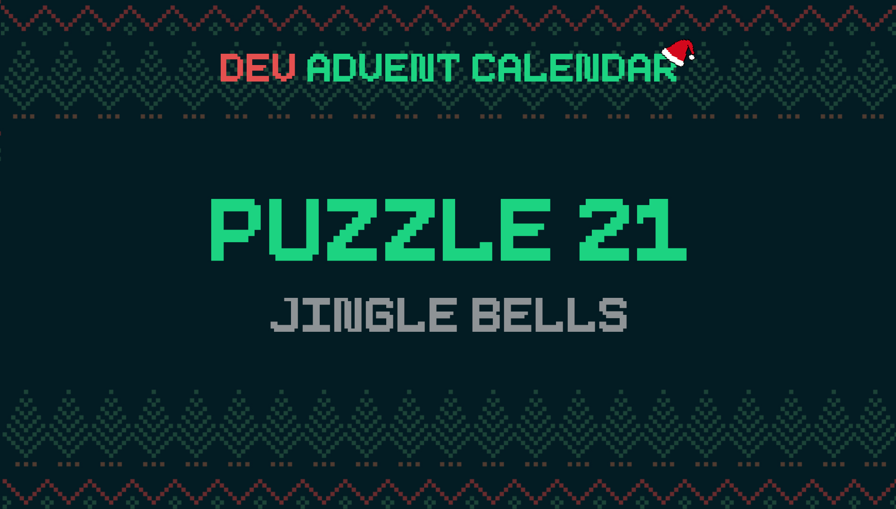

ℹ️ For detailed information about the contest, check out [devadvent/readme](https://github.com/devadvent/readme/)

# Dev Advent Calendar 🎅 Puzzle 21 - Jingle Bells 🔔

The elves have a box with papers where they wrote letters on it. When interpreted correctly, they are Christmas songs.

Write an interpreter for those Christmas song strings.

## 🧩 The puzzle

In the [index.html](index.html) there is a string of notes in a `<input>` field which is passed to the `playMelody()` method in [utils/notes.js](utils/notes.js). There is also a function `stopMelody()` which stops the melody.

Your job is to create two different things:

1. A metronome to determine the speed of the song
2. Play the melody

### Metronome

Complete the function `startMetronome` and `stopMetronome` in [utils/metronome.js](utils/metronome.js)

`startMetronome` takes two parameters:

-   `bpm`: "beats per minute". How often per minute a certain function should be executed.
-   `fn`: Function that gets executed on each "tact"

💡 Hint: Make sure to stop a possible metronome that's already running

Example of a call:

```javascript
startMetronome(120, () => console.log('HO HO HO'))
```

`stopMetronome` doesn't take a parameter, and should just stop the metronome from "ticking" (executing the function).

### Play the melody

In order to play the melody, you need 3 functions:

-   `getFrequency`: Transform a given note (`G`, `D`, etc.) to the [corresponsing frequencies](https://mixbutton.com/mixing-articles/music-note-to-frequency-chart/). To make it easier, assume that the notes will be played in "octave 4".
-   `playMelody`: Use the `startMetronome` function you wrote in [utils/metronome.js](utils/metronome.js) in order to "play the melody": On each "tact" of the metronome, play the next note in the string. A space ` ` means a pause.
-   `stopMelody`: Stop playing the melody (stop the metronome)

### Explainations about `playNote`

See file [utils/audio.js](utils/audio.js).

-   `frequency`: [Frequency from the note](https://mixbutton.com/mixing-articles/music-note-to-frequency-chart)
-   `duraction`: Duration of the note. You can ignore this, unless you want to play around with it.

Example execution:

```javascript
playNote('G', 200)
```

## 🚢 Ship your solution

Check out the [contributing guide](https://github.com/devadvent/readme/blob/main/CONTRIBUTING.md) for details about how to participate.

In short:

-   ✨ Create your repository by [acceping the assignment](https://classroom.github.com/a/ZetfyqjM) using the participation link
-   💪 Solve the challenge
-   🐦 Add your Twitter handle to `twitter.js`
-   🤖 Test your solution
-   🚀 Upload your changes to the `main` branch

## 🔗 Participation link

In order to participate, you need to enter the following link and accept the assignment:
[https://classroom.github.com/a/ZetfyqjM](https://classroom.github.com/a/ZetfyqjM)

## 💻 Use this project

### ⏳ Install the dependencies

Install the dependencies with

```bash
yarn install
```

or

```bash
npm install
```

### ⚙️ Run the code

Run the code with

```bash
yarn dev
```

or

```bash
npm run dev
```

### 🤖 Test your solution

This puzzle is equipped with automated tests (in the `./tests` folder). In order for your solution to qualify for winning the daily prize, **all** tests need to pass.

To run these tests, execute one of the following commands in your console:

> Note: Tests for this project will take longer (a few seconds), because it tests the correct functioning of the metronome. Be patient 😉

```bash
yarn test
```

or

```bash
npm test
```
